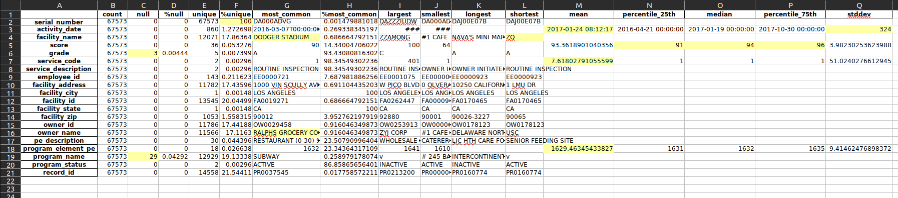
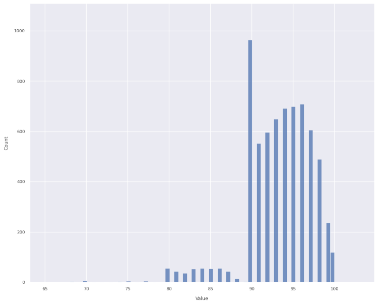
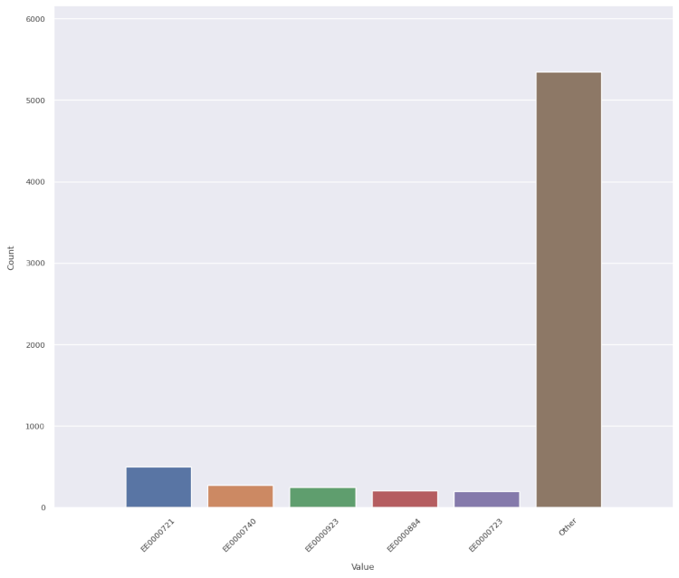
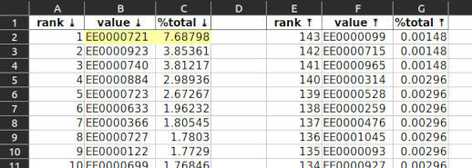
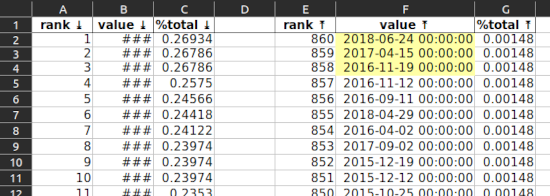
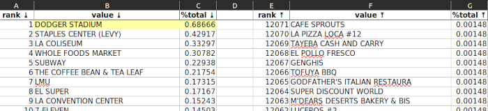
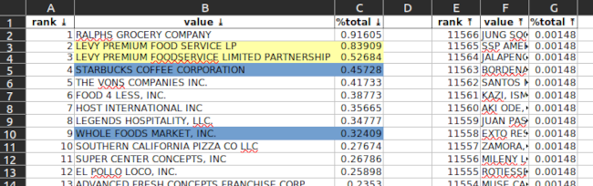
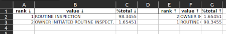

# Jupyter
[Notebooks](notebooks)

# profile_data.py
## Overview
### Origination
The idea for this code came from my time managing a team of data analysts for an internal audit department of a large company.

The audit team asks the business for certain data and, depending on the prevailing politics of the organization, may eventually receive such data or the permission necessary to extract it.

So, now you've got potentially a lot of data ... where do you tell your auditors to focus? Wouldn't it be helpful to have a program which quickly identifies interesting things? And by interesting I mean either likely incorrect, or likely correct but pointing to a business failure.

That's what this program does.

### Later learning
I later learned this type of analysis has an official name in data science circles: [exploratory data analysis](https://towardsdatascience.com/exploratory-data-analysis-8fc1cb20fd15).

## Usage
I grabbed sample Los Angeles restaurant inspection data from https://www.kaggle.com.
The URL at that time was https://www.kaggle.com/datasets/cityofLA/la-restaurant-market-health-data. 

### Installation
- `git clone https://github.com/jsf80238/data_science.git`
- `cd data_science`
- `python3 -m venv your_dir`
- `source your_dir/bin/activate`  # or on Windows `your_dir\Scripts\activate.bat`
- `pip install -r requirements.txt`

### Database support
As-is this program supports Microsoft SQL Server, Postgresql and Snowflake.

Supporting additional database flavors _should_ be a matter of adding the appropriate JDBC jar to `data_science/data_science/lib/jars` and editing `data_science/config/config.yaml`.

### Execution
    $ python data_science/profile_data.py -h
    usage: profile_data.py [-h] [--header-lines NUM] [--delimiter CHAR] [--sample-rows NUM]
                           [--max-detail-values NUM] [--max-pattern-length NUM]
                           [--plot-values-limit NUM] [--no-pattern] [--no-histogram] [--no-box]
                           [--no-pie] [--no-visual] [--max-longest-string NUM]
                           [--object-sampling-limit NUM] [--object-conversion-allowed-error-rate NUM]
                           [--target-dir /path/to/dir] [--html] [--get-cleaned-version FILE_NAME]
                           [--db-host-name HOST_NAME] [--db-port-number PORT_NUMBER]
                           [--db-name DATABASE_NAME] [--db-user-name USER_NAME] [--db-password PASSWORD]
                           [--environment-file /path/to/file] [--verbose | --terse]
                           /path/to/input_data_file.extension | query-against-database
    
    Profile the data in a database or file. Generates an analysis consisting tables and images stored in
    an Excel workbook or HTML pages. For string columns provides a pattern analysis with C replacing
    letters, 9 replacing numbers, underscore replacing spaces, and question mark replacing everything
    else. For numeric and datetime columns produces a histogram and box plots.
    
    positional arguments:
      /path/to/input_data_file.extension | query-against-database
                            An example query is 'select a, b, c from t where x>7'. File names must end
                            in csv, dat, txt, dsv or parquet. See also --delimiter.
    
    options:
      -h, --help            show this help message and exit
      --header-lines NUM    When reading from a file specifies the number of rows to skip UNTIL the
                            header row. Ignored when getting data from a database. Default is 0. (must
                            be in range 1..=9223372036854775807)
      --delimiter CHAR      Use this character to delimit columns, default is a comma. Ignored when
                            getting data from a database or a parquet file.
      --sample-rows NUM     When reading from a file randomly choose this number of rows. If greater
                            than or equal to the number of data rows will use all rows. Ignored when
                            getting data from a database. (must be in range 1..=9223372036854775807)
      --max-detail-values NUM
                            Produce this many of the top value occurrences, default is 35. (must be in
                            range 1..=9223372036854775807)
      --max-pattern-length NUM
                            When segregating strings into patterns leave untouched strings of length
                            greater than this, default is 50. (must be in range 1..=9223372036854775807)
      --plot-values-limit NUM
                            Don't make histograms or box plots when there are fewer than this number of
                            distinct values, and don't make pie charts when there are more than this
                            number of distinct values, default is 8. (must be in range
                            1..=9223372036854775807)
      --no-pattern          Don't identify patterns in text columns.
      --no-histogram        Don't make histograms.
      --no-box              Don't make box plots.
      --no-pie              Don't make pie charts.
      --no-visual           Don't make histograms or box plots or pie charts.
      --max-longest-string NUM
                            When displaying long strings show a summary if string exceeds this length,
                            default is 50. (must be in range 50..=9223372036854775807)
      --object-sampling-limit NUM
                            To determine whether a string column can be treated as datetime or numeric
                            sample this number of values, default is 500. (must be in range
                            1..=9223372036854775807)
      --object-conversion-allowed-error-rate NUM
                            To determine whether a string column can be treated as datetime or numeric
                            allow up to this percentage of values to remain un-parseable, default is 5.
                            (must be in range 1..=100)
      --target-dir /path/to/dir
                            Default is the current directory. Will make intermediate directories as
                            necessary.
      --html                Also produce a zip file containing the results in HTML format.
      --get-cleaned-version FILE_NAME
                            Output the Pandas data frame in CSV or Parquet format. Might be useful if
                            string columns were converted to datetimes/numerics. File name must end in
                            '.csv' or '.parquet'.
      --db-host-name HOST_NAME
                            Overrides HOST_NAME environment variable. Ignored when getting data from a
                            file.
      --db-port-number PORT_NUMBER
                            Overrides PORT_NUMBER environment variable. Ignored when getting data from a
                            file.
      --db-name DATABASE_NAME
                            Overrides DATABASE_NAME environment variable. Ignored when getting data from
                            a file.
      --db-user-name USER_NAME
                            Overrides USER_NAME environment variable. Ignored when getting data from a
                            file.
      --db-password PASSWORD
                            Overrides PASSWORD environment variable. Ignored when getting data from a
                            file.
      --environment-file /path/to/file
                            An additional source of database connection information. Overrides
                            environment settings.
      --verbose
      --terse
- Download your data.
- `python data_science/python profile_data.py ~/Downloads/restaurant-and-market-health-inspections.csv`
- View the results from `analysis.xlsx` in your current directory, or the `--target-dir` directory if provided.

### Results
The program generates a XLSX file containing multiple sheets:
- Summary.
- Number-of-occurrences detail, one sheet per column in the data source.
- String patterns, one sheet per string-type column in the data source.
- Depending on the data and the `--plot-values-limit` argument:
  - Histogram, one sheet per numeric/datetime column in the data source.
  - Box plot, one sheet per numeric/datetime column in the data source.
  - Pie plot, for each column in the data source, but see

> [!TIP]
> Optionally, use the `--html` command-line argument to also generate `analysis.zip`.
> 
> Unzip and point your browser at `analysis.html`.

This is an example summary:

Let's focus on the highlighted cells.
- C6, C19: these are likely data quality issues. As a percentage of the total data set can be ignored.
- F2: `serial_number` is unique. Good.
- G4: The most common `facility_name` for restaurants is "DODGER_STADIUM". That's odd.
- G16: And yet the most common `owner_name` is Ralph's Grocery CO. Probably https://www.ralphs.com/.
- L4: The shortest `facility_name` is "ZO". Probably a data quality issue.
- M3, Q3: Dates are treated as numeric. They can essentially be thought of as the number of seconds after some date. See also https://www.epochconverter.com/ for Linux. Windows has a [similar concept](https://devblogs.microsoft.com/oldnewthing/20090306-00/?p=18913). 
- N5, O5, P5: 50% of the scores were between 91 and 96.
- M7, M18: the program treats numbers as measurements, even though for these columns the numbers are just IDs. Perhaps more sophisticated code could do better.

Now, details by column.
#### score

- As a first estimate I would have guessed this would look like a Bell curve, perhaps with a bit of [skew](https://www.itl.nist.gov/div898/handbook/eda/section3/eda35b.htm).
- Instead, we many more scores of 90 than expected and much fewer scores of 89 than expected (and fewer in the 80s than expected).
- Without proof I would guess:
  - A score of 90-100 yields a sign in the restaurant window with the letter A.
  - A score of 80-99 yields a sign in the restaurant window with the letter B.
  - People don't like to eat at restaurants which fail to achieve a A-rating.
  - Restaurant owners, and to a lesser extent restaurant inspectors, strive to avoid anything other than a A-rating. (Image below courtesy of https://la.eater.com/2015/8/19/9178907/la-county-health-department-restaurant-grades-need-overhaul.)

#### employee_id

- One employee (EE0000721) among the 143 who performed inspections handled one out of every fourteen inspections. And it was twice as many as the next busiest inspector. Why?

#### activity_date

- Note the dates with very few inspections (F2, F3, F4 ...). These are Saturdays and Sundays. It makes sense inspectors (city staff) don't work as much on weekends.

#### facility_name

- Again, "DODGER STADIUM" leads the way. Are there more restaurants in Dodger Stadium than there are Subway restaurants in all of Los Angeles?

#### owner_name

- Note the yellow-highlighted cells. This looks to be a data-quality issue .. Levy Premium Food listed twice. When added together this would be the top owner, not Ralph's.
- Note the blue-highlighted cells. Is true there are only 50% more Starbucks than Whole Foods?

#### service_description

- Only 1.65% of inspections were initiated by the owner. Probably makes sense.
- All inspections are some variation of "routine", apparently.

### More execution examples
**Get data from a database**

    export MY_PASSWORD="password"
    
    $ python data_science/profile_data.py --tar=/tmp --db-host=localhost --db-port=5432 --db-name=example --db-user=postgres \
      "select entry_date, amt as amount, part_number from my_table where category != 'misc'"

**Get data from a database, with environment file**

    $ cat /path/to/postgres.env
    HOST_NAME="localhost"
    PORT_NUMBER=5432
    DATABASE_NAME="example"
    USER_NAME="postgres"
    PASSWORD="postgres"
    
    $ python data_science/profile_data.py --tar=/tmp --env=/path/to/postgres.env "select entry_date, amt as amount, part_number from my_table where category != 'misc'"

**Parquet file, with sampling**
    
    $ python data_science/profile_data.py --tar=/tmp --sample=10000 /path/to/datafile.parquet

**Tab-delimited file, also produce zip file containing HTML output**
    
    $ python data_science/profile_data.py --tar=/tmp --del="\t" --html /path/to/datafile.csv

**Require perfection to convert string data to numeric or datetime**

    $ python data_science/profile_data.py --tar=/tmp --object-conversion-allowed-error=0 /path/to/datafile.csv

**Accept default 5% error rate when attempting to convert string data to numeric or datetime, but sample 1000 rows instead of 500**

    $ python data_science/profile_data.py --tar=/tmp --object-sampling-limit=1000 /path/to/datafile.csv

**Write reformatted numerics or datetimes back to a file**

    $ python data_science/profile_data.py --tar=/tmp --get-clean=reformatted.csv /path/to/datafile.csv

**Don't produce box plots or string pattern analyses**

    $ python data_science/profile_data.py --tar=/tmp --no-box --no-pattern /path/to/datafile.csv

## Potential improvements
- Check for duplicate data.
- Allow the caller to specify the expected format for datetime columns, because knowing the format would allow us to make certain optimizations.
- Allow the caller to specify columns to exclude, or include.
- Generate better plots. It is difficult to generate useful plots on an automated basis.
  - Add a [correlation matrix](https://pandas.pydata.org/docs/reference/api/pandas.DataFrame.corr.html#pandas.DataFrame.corr). 
  - You might want a histogram for numeric or datetime data, but if the column is a primary key, or a created timestamp generated by a trigger, then each value will appear (almost always) one time, making a histogram uninteresting.
  - Allow the caller to specify [plot appearance attributes](https://matplotlib.org/stable/api/axes_api.html).
